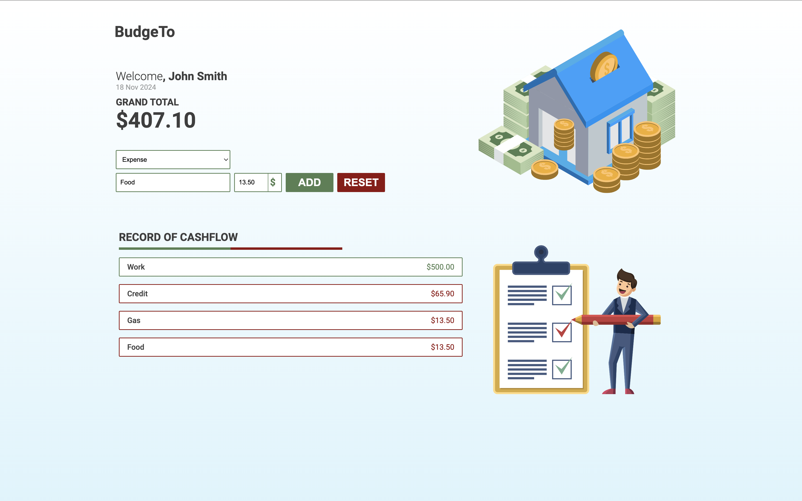

Budget Tracker
============

The Budget Tracker application helps users manage their finances by allowing them to track their income and expenses. The app provides a dynamic interface to visualize cash flow and calculates the remaining budget in real time.

---

## Features
- Track Income and Expenses: Enter a description and amount for each income or expense.
- Real-Time Updates: Automatically updates the total budget based on user inputs.
- Error Handling: Validates user inputs and displays error messages for invalid entries.
- Reset Options: Clear the list of cash flow items and reset the budget to zero.
- Responsive Design: Adapts to different screen sizes, providing an optimized experience across devices.

---

## Setup
Clone this repo to your desktop and run `npm install` to install all the dependencies.

You can now look into `package.json` to make sure SASS has been installed as a dependency.

---

## Usage
## Adding Entries:

1. Enter a description in the first input field (e.g., "Freelance Job").
2. Enter an amount in the second input field (e.g., "500").
3. Select whether it is an income or expense from the dropdown menu.
4. Click the **Submit** button to add the entry to the list and update the budget.

## Viewing Cash Flow:

- Entries appear under the **"Cash Flow"** section.
- Income entries are displayed in **green**, while expenses are shown in **red**.

## Resetting Data:

- Click the **Reset** button to clear all entries.
- Double-click the **Reset** button to also reset the total budget to **$0.00**.

## Error Handling:

- If the amount field is empty or contains invalid characters:
    - An error message will be displayed.
    - The input fields will be highlighted in **red** in the app console.

---

## License
>You can check out the full license [here](https://github.com/YVictorin/budgetTracker)

This project is licensed under the terms of the **MIT** license.
